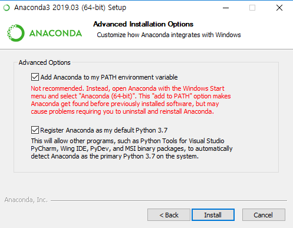
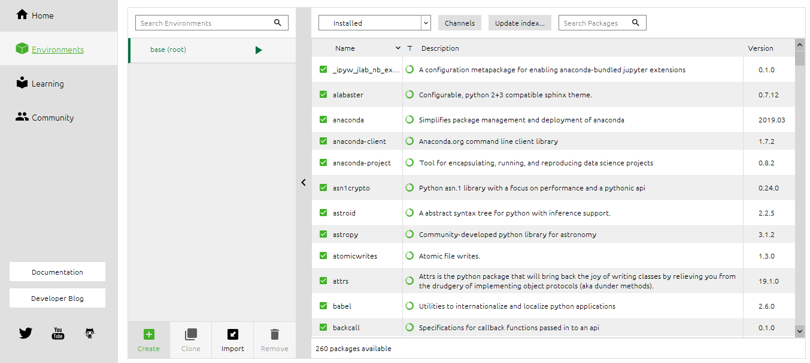
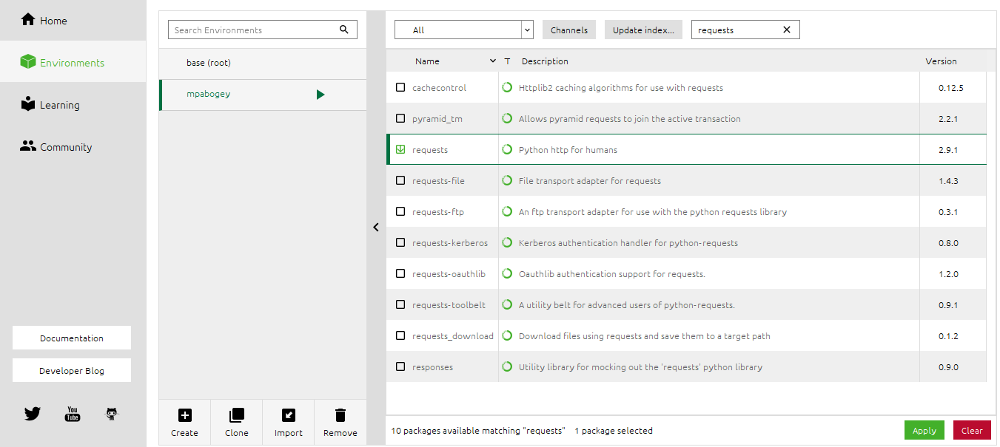
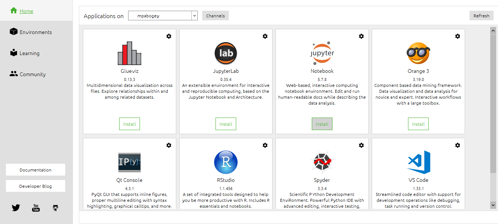
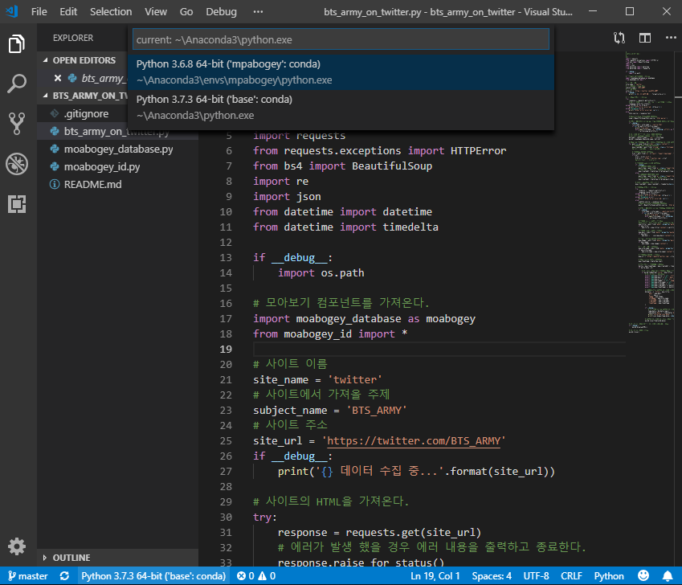
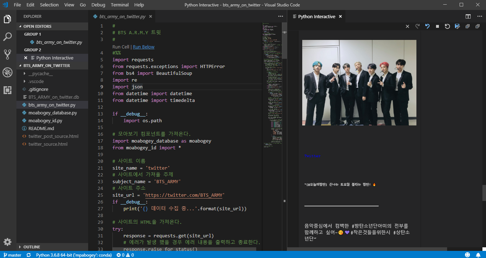

# 개발 환경 만들기

봇을 개발하기 위해서는 몇가지 소프트웨어를 설치하고 환경을 설정해야 합니다. 설치할 컴퓨터의 OS에 따라서 설치 방법이 다를 수 있습니다. 여기서는 OS종류를 다음과 같이 표시합니다. (🖼 는 윈도우즈, 🍎는 맥)

## 아나콘다(Anaconda) 설치 및 환경 설정

모아보기에서 동작하는 봇은 파이썬(Python)으로 개발합니다. 파이썬은 데이터 과학 분야 및 인공지능 개발에 많이 사용되는 프로그래밍 언어입니다. 또한 웹봇 개발에 필요한 여러가지 유용한 모듈을 가지고 있습니다. 파이썬에 대한 자세한 사항은 [여기](<https://ko.wikipedia.org/wiki/%ED%8C%8C%EC%9D%B4%EC%8D%AC>)를 참조하세요.

아나콘다(Anaconda)는 데이터 과학 및 인공지능 개발에 필요한 모듈을 모아놓은 파이썬 배포판입니다. 또한 주피터 노트북(Jupyter Notebook)이라는 웹 기반의 파이썬 개발 환경을 제공합니다. 우리는 아니콘다를 설치하고 봇 개발에 필요한 환경을 세팅하고 중요한 모듈들을 설치할 것입니다.

### 설치 (Install)

1. https://www.anaconda.com 로 이동한다.

2. 상단의 오른쪽에 있는 `Download`  버튼을 누른다.

3. 설치할 OS를 선택한다.

4. `Python 3.X` version의 `Download` 버튼을 누른다. 

5. 🖼  (주의) AnLab Safe Transaction이 설치가 되어 있으면 제거하고 아나콘다를 설치한다.

6. 다운로드가 완료되면 파일을 연다.

7. 셋업 화면이 나오면 `Next` 버튼을 누른다.

8. 소프트웨어 사용권 동의서를 읽어보고 `I Agree`  버튼을 누른다.

9. 설치 타입은 **Just Me**를 선택하고 `Next`  버튼을 누른다.

10. 설치 위치를 확인하고 `Next` 버튼을 누른다.

11. 설치 옵션에서 아래와 같이 두 항목을 모두 체크하고 `Install` 버튼을 누른다.

    

12. 마지막 항목에 두 항목을 모두 체크를 해제하고 `Finish` 버튼을 눌러서 설치를 완료한다.

### 환경 설정 (Set up)

1. **Anaconda Navigator**를 실행한다.

2. 왼쪽 사이드 메뉴에서 `Environments`를 선택한다.

   

3. 중간 아래쪽 메뉴에서 `Create` 버튼을 누른다.

4. Name은 **moabogey**, **Python은 3.6**을 선택하고 `Create`버튼을 누른다.

5. 상단 선택바에서 Installed를 All로 바꾸고 상단 검색창에서 **requests**를 검색한다.

6. 리스트에서 requests를 선택한다.

   

7. 상단 검색창에서 **beautifulsoup4**를 검색하고 리스트에서 선택한다.

8. 상단 검색창에서 **pylint**를 검색하고 선택한다.

9. 하단에서 3 packages selected를 확인하고 `Apply`버튼을 누른다.

10. 설치가 완료되면 왼쪽 사이드 메뉴에서 `Home`을 선택한다.

11. Application on 선택바에서 **moabogey**가 선택 되었는지 학인하고 `Jupyter Notebook Install`버튼을 누른다.

    

12. 설치가 완료되면 Anaconda Navigator를 종료한다.

## 깃(Git) 설치

깃(Git)은 우리가 만든 소프트웨어를 관리하기 위한 툴(Tool)입니다. 깃허브 (GitHub)에서 봇 예제 소스코드를 받아오고, 직접 만든 봇을 깃허브에 올리는 작업들을 깃 명령어를 통해서 수행됩니다.

### 🖼 윈도우즈(Windows)에서 깃(Git) 설치

1. https://git-scm.com/downloads로 이동한다.

2. `Windows`를 선택하면 다운로드가 시작된다.

3. 다운로드가 완료되면 파일을 연다.

4. `Next` > `Next` > `Next` > `Next` >  `Next` > `Next` > `Next` > `Next` > `Next`를 선택한다.

5. **Configuring the terminal emulator to use with Git Bash**에서 `Use Windows' default console window`를 선택하고 `Next`를 누른다.

6. `Install`을 눌러서 설치를 시작한다.

7.  `Finish` 버튼을 눌러서 설치를 완료한다.

8. Windows PowerShell을 실행한다.

9. 아래와 같이 사용자 이름(아이디)와 이메일 주소를 입력한다.

   ```
   git config --global user.name "사용자 이름"
   git config --global user.email "이메일" 
   ```

### 🍎 맥(MAC)에서 깃(Git)설치 

1. 터미널(Terminal)을 실행한다.

2. 아래 명령어를 실행한다.

   ```
   git --version
   ```

3. git이 설치되어 있지 않으면 설치 메시지가 뜬다.

4. `설치` 버튼을 눌러서 설치를 시작한다.

5. 아래와 같이 사용자 이름(아이디)와 이메일 주소를 입력한다. (깃허브 가입시에 사용한 사용자이름과 이메일 주소와 동일해야 한다.)

   ```
   git config --global user.name "사용자 이름"
   git config --global user.email "이메일" 
   ```

## 비주얼 스튜디오 코드(Visual Studio Code) 설치 

코드를 작성하고 테스트 할 수 있는 개발툴로서 마이크로 소프트의 Visual Studio Code (줄여서 VSCode)를 사용합니다. 전세계에서 가장 인기있는 개발 툴이며, 깃(Git)을 사용하기 쉽고 아나콘다의 주피터 노트북(Jupyter Notebook)과의 연동이 편리한 장점이 있습니다. 

1. https://code.visualstudio.com/ 로 이동한다.
2. 🖼 `Download for Windows` 버튼을 누른다.
3. 🍎 `Download for Mac` 버튼을 누른다.
4. 다운로드가 완료되면 파일을 연다.
5. 설치 마법사가 뜨면 다음을 누른다.
6. 사용권 계약에 동의하고 다음을 누른다.
7. 대상 위치를 확인하고 다음을 누른다.
8. 시작 메뉴 폴더 선택을 확인하고 다음을 누른다.
9. 대상 위치를 확인하고 다음을 누른다.
10. 시작 메뉴 폴더 선택을 확인하고 다음을 누른다.
11. Visual Studio Code 시작을 체크 해제하고 마침을 누른다.

## 예제 파일 실행

1. 🖼  Windows PowerShell을 실행한다.

2. 🍎 Terminal을 실행한다.

3. 작업할 폴더를 생성한다.

   ```
   mkdir MyWork
   ```

4. 작업할 폴더로 이동한다.

   ```
   cd MyWork
   ```

5. 깃 클론 (Git Clone)을 수행한다.

   ```
   git clone https://github.com/skettee/bts_army_on_twitter.git
   ```

6. 복사한 코드의 폴더로 이동한다.

   ```
   cd bts_army_on_twitter
   ```

7. VSCode를 실행한다.

   ```
   code .
   ```

8. 왼쪽 EXPLORE에서 bas_army_on_twitter.py를 선택한다.

9. 하단 바에 `Python3.7.3 64-bit('base':conda)`를 누른다.

10. **Python 3.6.8 64-bit ('moabogey':conda)**를 선택한다.

    

11. 소스 코드에 RunCell | Run Below에서 Run Below를 누른다.

12. 데이터가 정상적으로 수집이 되는지 오른쪽 Python Interactive에서 확인한다. 

    

